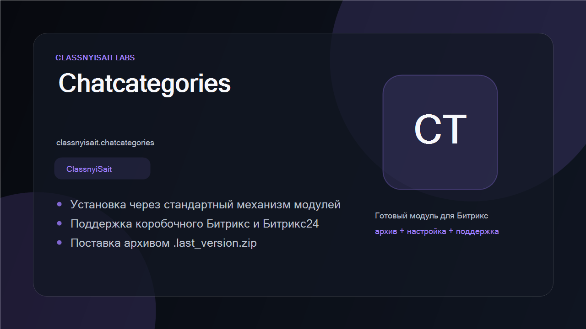
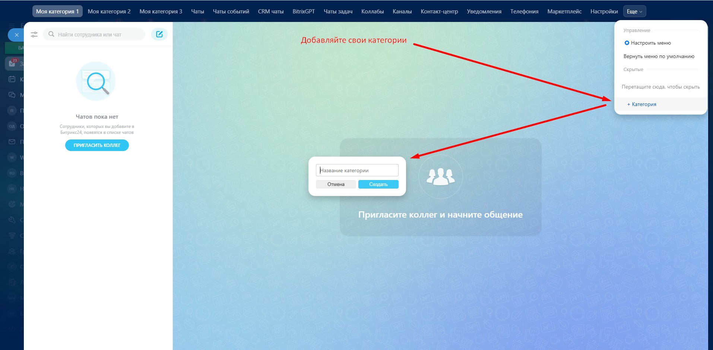
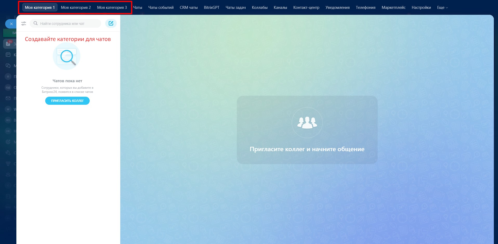
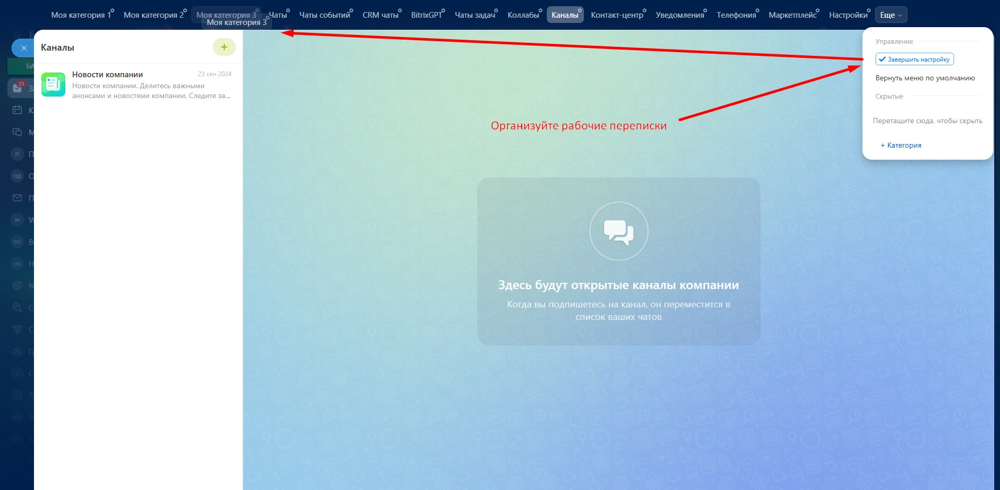

# Chat Categories for Bitrix24

[Русская версия](README.ru.md) · [MIT License](LICENSE)

[](https://github.com/ClassnyiSait-Labs/bitrix24-chat-categories/actions/workflows/ci.yml) [](https://github.com/ClassnyiSait-Labs/bitrix24-chat-categories/releases/latest) [](https://www.php.net/) [](LICENSE)


Free and open-source module for **self-hosted Bitrix24** that lets every user organise the
messenger with their own chat categories — custom tabs next to the built-in ones.



## Why

The Bitrix24 messenger gives you one flat "Recent" list plus a few fixed tabs. Once you are in
several dozen chats, finding the right conversation becomes scrolling. This module lets each user
group their chats the way they actually work — per project, per client, per team.

## Features

- Create personal chat categories — up to 50 per user.
- Add a chat to a category from the chat context menu.
- Rename and delete categories.
- Reorder tabs with drag & drop.
- Per-user data: categories are private, nobody else sees them.
- Safe uninstall: tables and data are removed only when the administrator explicitly chooses it.

## Requirements

- Self-hosted Bitrix24, version 26.0 or newer
- Web version of the messenger

## Installation

1. Copy the `classnyisait.chatcategories` folder into `/local/modules/` (or `/bitrix/modules/`).
2. **Marketplace → Installed solutions** → *Chat categories* → *Install*.
3. Reload the messenger — the categories UI appears next to the standard tabs.

Marketplace listing: <https://classnyisait.ru/modules/>

## Screenshots

| Context menu | Category tab | Drag & drop sorting |
| --- | --- | --- |
|  |  |  |

## Project layout

```
classnyisait.chatcategories/
├── install/            installation, SQL schema, front-end assets (JS/CSS)
├── lib/Controller/     AJAX controller for category CRUD
├── lib/Model/          D7 ORM tables (categories, chat↔category links)
├── lib/EventHandler.php  messenger UI integration
└── test/               PHP and JS tests
```

## Development

```bash
composer install
composer test          # 59 PHPUnit tests
npx jest              # 41 Jest tests
```

Tests cover the pure logic that runs without a Bitrix kernel. Anything touching the
database, the basket or the messenger UI needs a live portal and is verified manually —
see [CONTRIBUTING.md](CONTRIBUTING.md).

CI runs the linter and the test suite on PHP 8.1, 8.2 and 8.3 for every push and pull request.

## Contributing

Issues and pull requests are welcome. Please state your Bitrix24 build number and browser when
reporting a UI problem.

## License

MIT — see [LICENSE](LICENSE).

Developed by [ClassnyiSait Labs](https://classnyisait.ru/) ·
[Support the developer](https://classnyisait.ru/support)
